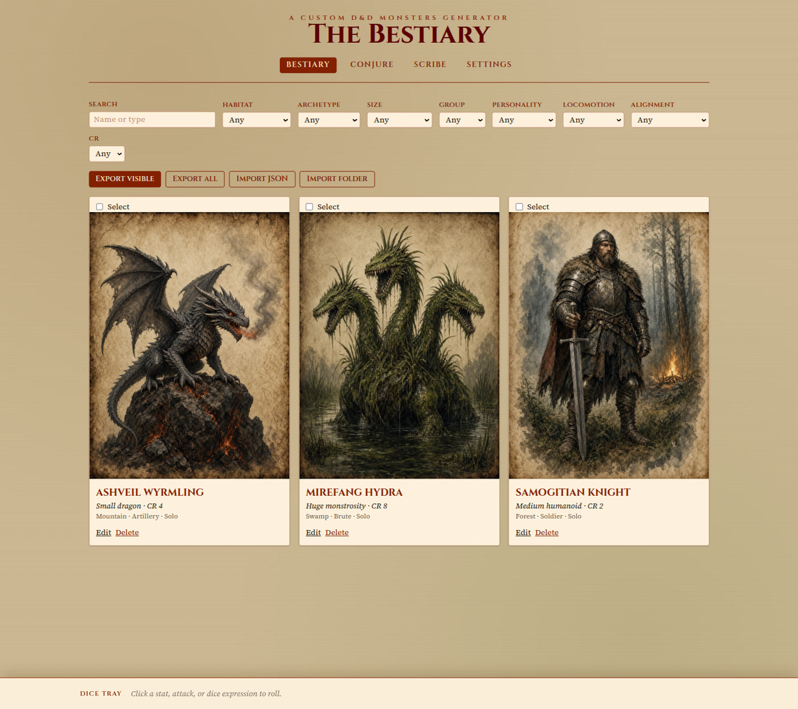
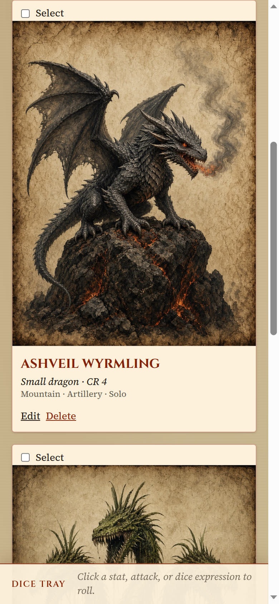
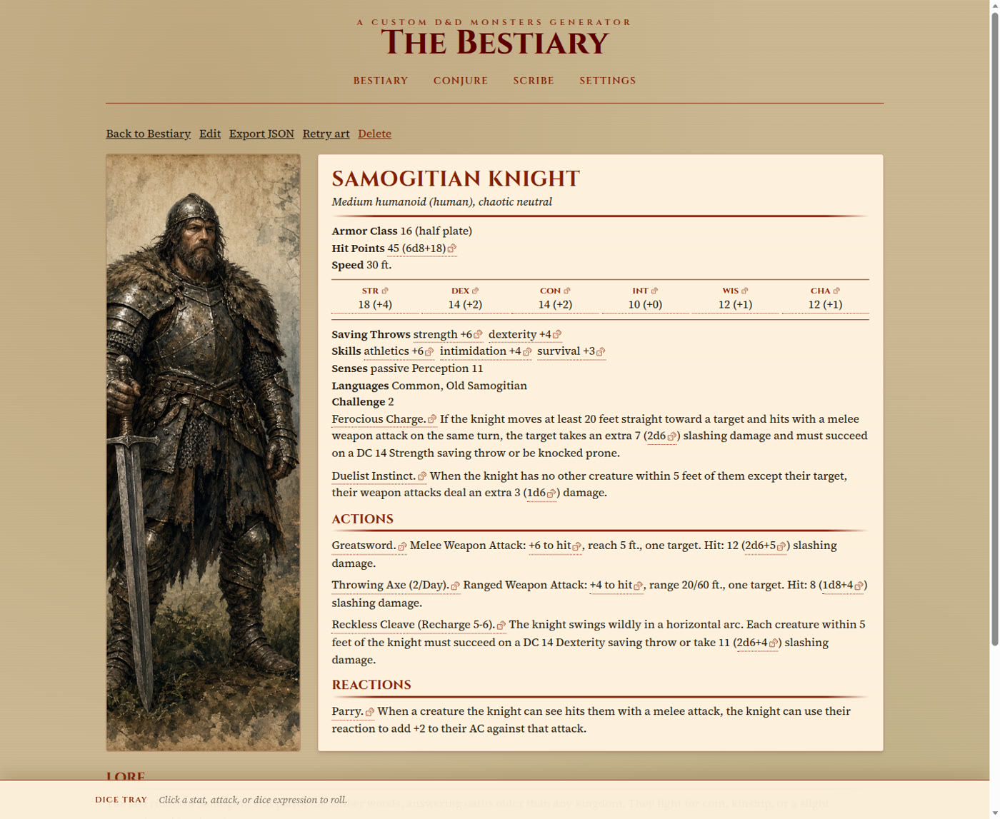
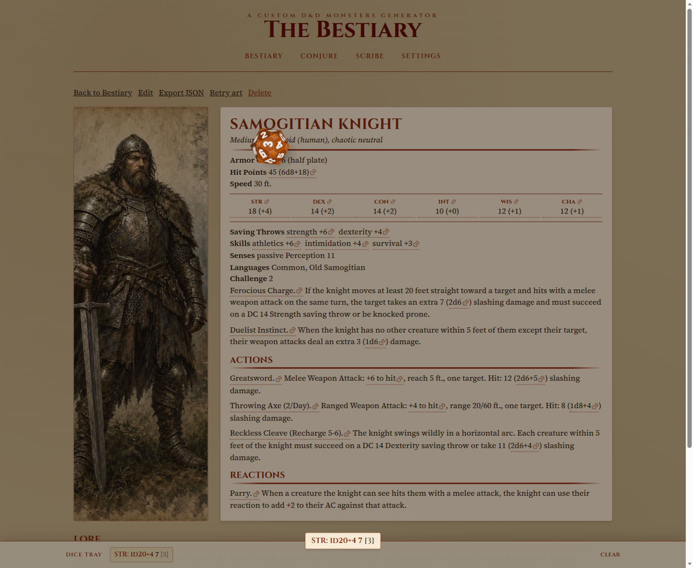
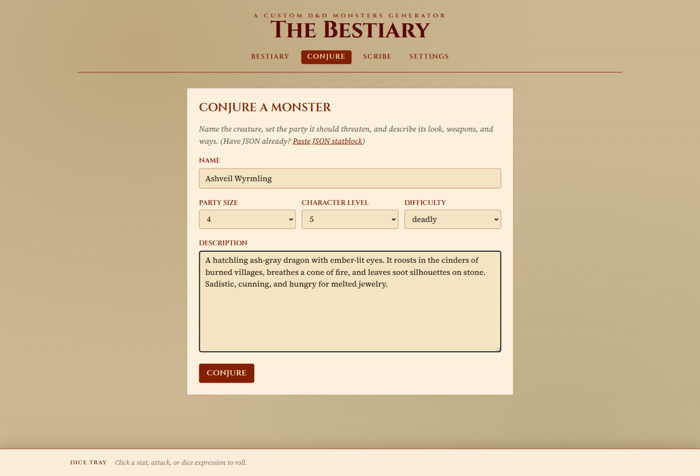
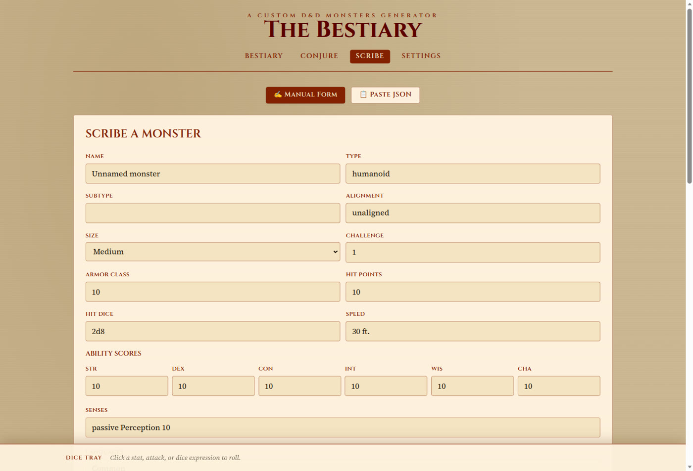
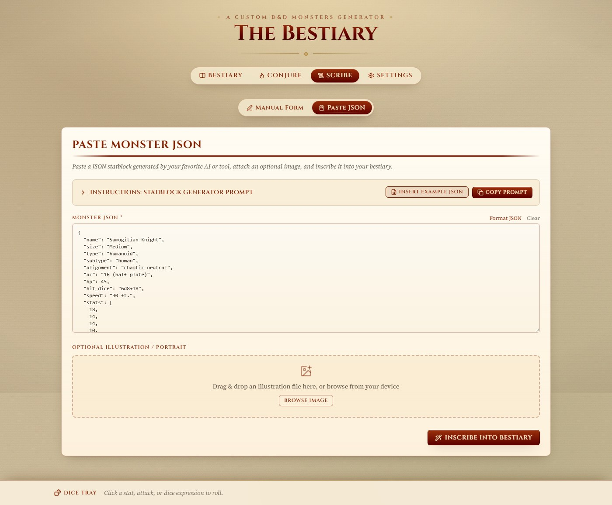
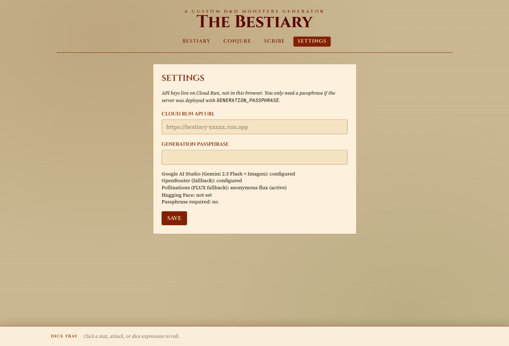

# 🐉 The Bestiary

A D&D 5e monster workshop: conjure AI-crafted creatures, hand-scribe custom statblocks, view authentic parchment sheets, and roll interactive 3D physics dice directly from the statblock.

🌐 **Live Website**: [https://bestiary-api-4klhpyohsa-uc.a.run.app/](https://bestiary-api-4klhpyohsa-uc.a.run.app/)  
📖 **GitHub Pages (Alternative)**: [https://almantask.github.io/dnd-monster-generator/](https://almantask.github.io/dnd-monster-generator/)

<p align="center">
  
</p>

---

## ✨ Features

- **🧙 AI Monster Conjuration**: Generate balanced D&D 5e statblocks from a name, description, party size, character level, and difficulty (Very Easy to Deadly). Encounter budget math calibrates CR. Primary path is Google AI Studio (Gemini 3.5 Flash / Flash Latest), with OpenRouter free models as fallback.
- **🎨 AI Portrait Generation**: Painted parchment-style portraits via Gemini image models (then Imagen), with free Cloudflare Workers AI FLUX and Pollinations FLUX fallbacks. Gemini/Imagen portraits need billing enabled on the AI Studio project; free-tier keys have zero image quota and fall back to Cloudflare (10,000 free neurons/day), then Pollinations. Retry art from any saved entry.
- **🎲 Interactive 3D Physics Dice**: Click ability scores, saving throws, skills, attack rolls (`+N to hit`), damage formulas (`2d6+3`), hit dice, recharge text, or a whole feature name. Dice fly in a Three.js / Rapier3D overlay; totals land in the bottom dice tray.
- **📜 Scribe & Statblock Editor**: Hand-build or amend a monster with ability scores, defenses, traits, actions, reactions, legendary actions, spells, lore, tactics, drops, and a local illustration upload.
- **📋 Paste JSON**: Drop in AI-generated or exported statblock JSON, format/validate it, attach optional art, and inscribe it. Includes a copyable generator prompt and an example Samogitian Knight.
- **📚 Local Bestiary Library**: Search by name or type and filter by habitat, archetype, size, group, personality, locomotion, alignment, and CR. Data stays on-device in IndexedDB (Dexie).
- **📦 Backup, Import & Export**: Export selected or all monsters as JSON, download a `.zip` with high-res portraits, and import JSON files, zip archives, or a whole folder.
- **⚙️ Cloud Run Settings**: Point the UI at an API URL, optionally send a generation passphrase, and see which image/LLM providers the server has configured.

---

## 🖼️ Screens

### Bestiary library

Search, filter, select, and export your creatures. Cards show the painted portrait, size, type, CR, and taxonomy tags.


Narrow viewports stack the same cards into a scrollable tome:



### Parchment statblock

Open an entry to read the full 5e-style sheet beside its portrait. Dotted dice marks show every rollable expression. Lore, tactics, and drops sit below the sheet.



### 3D dice overlay

Clicking a stat (here Strength) throws a physical d20. The overlay shows the die, a result banner, and the persistent tray at the bottom.



### Conjure

Name the creature, set the party it should threaten, and describe look, weapons, and ways. The server writes the statblock, then paints a portrait.



### Scribe (manual form)

Every field of the statblock is editable, including taxonomy, feature lists, lore, and an illustration upload.



### Scribe (paste JSON)

Paste a JSON statblock from any AI, insert the built-in example, copy the generator prompt, and attach a portrait.



### Settings

API keys stay on Cloud Run. The browser only stores an optional API URL override and generation passphrase, and shows which providers the server has configured.



---

## 📖 Quick User Guide

### 1. Conjuring a Monster
1. Navigate to **[Conjure](https://bestiary-api-4klhpyohsa-uc.a.run.app/#/conjure)**.
2. Enter a creature name and a thematic description or concept.
3. Select your **Party Size**, **Average Level**, and desired **Difficulty** (e.g. Medium, Deadly).
4. Click **Conjure** — the AI will generate the statblock and painted portrait.
5. Review the result, make manual tweaks if needed, and save it to your Bestiary.

### 2. Rolling Dice from the Statblock
- Click on any **Ability Score** or **Modifier** to roll a d20 check.
- Click on any **Attack Bonus** (e.g., `+7 to hit`) to roll an attack.
- Click on any **Damage Expression** (e.g., `2d10 + 4 fire damage`) to roll damage dice.
- Click on **Recharge** text (e.g., `Recharge 5–6`) to roll for recharge.
- Click a **feature name** (trait, action, reaction) to roll every expression in that feature.
- Dice roll with real-time physics in the 3D overlay; totals collect in the tray at the bottom of the page.

### 3. Scribing & Editing
- Go to **[Scribe](https://bestiary-api-4klhpyohsa-uc.a.run.app/#/scribe)** to handcraft a monster from scratch or edit an existing one.
- Use the **Paste JSON** tab to import existing statblock data or raw JSON directly, optionally with a portrait.

### 4. Backing Up Your Monsters
- On the **[Bestiary](https://bestiary-api-4klhpyohsa-uc.a.run.app/#/)** page, use the export buttons to save selected, visible, or all monsters, including artwork in a `.zip` backup.
- Use **Import JSON** or **Import folder** to restore entries on another device.

---

## 🛠️ Local Development

### Prerequisites
- Node.js 22+
- (Optional) API key from [Google AI Studio](https://aistudio.google.com/apikey) for Gemini statblocks (free tier works) and Gemini portraits (requires billing)
- (Optional) Free API key from [OpenRouter](https://openrouter.ai/) as an LLM fallback
- (Optional) Free [Cloudflare](https://dash.cloudflare.com/) account ID + Workers AI API token for free FLUX portraits (~120/day)

### Setup & Run

```bash
# 1. Install dependencies
npm install

# 2. Configure environment
cp .env.example .env
# Edit .env with your API keys (Gemini / OpenRouter)

# 3. Start local development (runs UI on :5173 and API on :8080)
npm run dev:all
```

Open `http://localhost:5173` in your browser.

### Quality Checks & Testing

```bash
npm test            # Run Vitest test suite
npm run typecheck   # Validate TypeScript types
npm run lint        # Fast Oxlint code analysis
npm run build       # Verify production bundle build
```

---

## 🚀 Deployment

The project is configured for one-click deployment to **Google Cloud Run**:

- **Continuous Deployment (CI/CD)**: Push to `main` triggers [.github/workflows/cloud-run.yml](.github/workflows/cloud-run.yml), validating tests and deploying to Cloud Run.
- **Detailed Instructions**: See [host_plan.md](host_plan.md) for Google Cloud credits, IAM service accounts, Secret Manager, and GitHub Secrets configuration.
